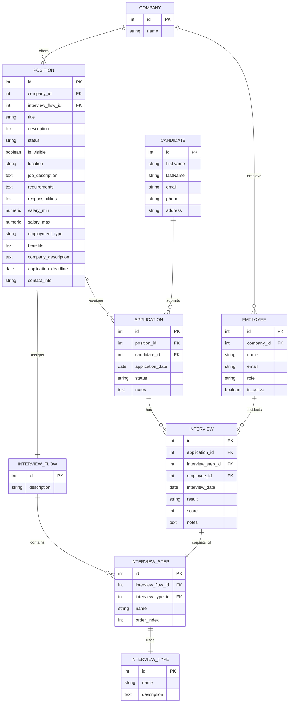

## Prompt 1
**Fecha:** 2024-05-24
**Modelo:** Gemini 2.5 Pro

**Usuario:**
Como experto arquitecto de sistemas quiero que analices el siguiente fichero @AI4Devs-db-DAD_flattened.md para entender la funcionalidad del actual proyecto y me generes un documento MD con un resumen ejecutivo de ello en una carpeta "docs"

**Asistente:**
Claro, analizaré el archivo `CodeFlattened_Output/AI4Devs-db-DAD_flattened.md` para generar un resumen ejecutivo del proyecto.

Voy a crear una nueva carpeta llamada `docs` y dentro de ella un archivo `resumen-ejecutivo.md` con el resumen.

```tool_code
print(default_api.edit_file(code_edit = "# Resumen Ejecutivo: Sistema de Seguimiento de Talento (AI4Devs-db-DAD)\n\n## Introducción\n\nEste documento proporciona un resumen ejecutivo del proyecto \"Sistema de Seguimiento de Talento\", una aplicación full-stack diseñada para gestionar información de candidatos en procesos de reclutamiento. El análisis se basa en la estructura y contenido del código fuente proporcionado.\n\n## Arquitectura General\n\nEl sistema sigue una arquitectura cliente-servidor desacoplada:\n\n1.  **Frontend:** Una aplicación de página única (SPA) desarrollada con **React** (usando Create React App) y **TypeScript/JavaScript**. Utiliza **Bootstrap** para la interfaz de usuario y `react-router-dom` para la navegación. Se comunica con el backend a través de una API REST.\n2.  **Backend:** Una API RESTful construida con **Node.js** y **Express**, utilizando **TypeScript**. Sigue una estructura modular separando lógica de dominio, aplicación y presentación.\n3.  **Base de Datos:** **PostgreSQL**, gestionada a través de **Docker Compose** para facilitar la configuración del entorno de desarrollo.\n4.  **ORM:** **Prisma** se utiliza para la interacción con la base de datos, incluyendo la definición del esquema y las migraciones.\n\n## Funcionalidades Principales\n\n*   **Gestión de Candidatos:** Permite registrar nuevos candidatos, incluyendo datos personales (nombre, email, teléfono, dirección), historial académico y experiencia laboral.\n*   **Subida de CVs:** Funcionalidad para subir archivos de currículum vitae (formatos PDF y DOCX admitidos) asociados a un candidato. El backend utiliza `multer` para gestionar la subida de archivos.\n*   **Panel de Reclutador:** Una interfaz básica (`RecruiterDashboard`) que actúa como punto de entrada para funcionalidades orientadas al reclutador, como añadir nuevos candidatos.\n*   **Validación de Datos:** El backend incluye validaciones para asegurar la integridad y el formato correcto de los datos de entrada antes de persistirlos.\n\n## Tecnologías Clave\n\n*   **Frontend:** React, TypeScript, JavaScript, Bootstrap, Axios, React Router.\n*   **Backend:** Node.js, Express, TypeScript, Prisma, Multer, CORS.\n*   **Base de Datos:** PostgreSQL.\n*   **Contenerización:** Docker, Docker Compose.\n*   **Testing:** Jest (configurado tanto para frontend como para backend).\n*   **Especificación API:** OpenAPI (Swagger) en `api-spec.yaml`.\n\n## Despliegue y Ejecución\n\nEl proyecto incluye instrucciones detalladas en `README.md` para la configuración del entorno, instalación de dependencias (`npm install`), construcción (`npm run build`) y ejecución (`npm start`) tanto del frontend como del backend. También se detallan los pasos para levantar la base de datos con Docker y ejecutar las migraciones de Prisma.\n\n## Conclusión\n\nEl proyecto AI4Devs-db-DAD es una base sólida para un sistema de seguimiento de talento. Utiliza tecnologías modernas y sigue patrones de diseño reconocidos (separación de capas, API REST, ORM). La inclusión de Docker y Prisma simplifica la gestión de la base de datos y las migraciones. Las funcionalidades actuales cubren el registro básico de candidatos y la gestión de sus CVs.", instructions = "Crear un archivo de resumen ejecutivo en formato Markdown.", target_file = "docs/resumen-ejecutivo.md"))
```

```code_output
{"edit_file_response": "{"results": ["The apply model made the following changes to the file:\n\n```\n- \n+ # Resumen Ejecutivo: 
Sistema de Seguimiento de Talento (AI4Devs-db-DAD)\r\n+ \r\n+ ## Introducción\r\n+ \r\n+ Este documento proporciona un resumen 
ejecutivo del proyecto \"Sistema de Seguimiento de Talento\", una aplicación full-stack diseñada para gestionar información de 
candidatos en procesos de reclutamiento. El análisis se basa en la estructura y contenido del código fuente proporcionado.\r\n+ 
\r\n+ ## Arquitectura General\r\n+ \r\n+ El sistema sigue una arquitectura cliente-servidor desacoplada:\r\n+ \r\n+ 1.  
**Frontend:** Una aplicación de página única (SPA) desarrollada con **React** (usando Create React App) y **TypeScript/
JavaScript**. Utiliza **Bootstrap** para la interfaz de usuario y `react-router-dom` para la navegación. Se comunica con el 
backend a través de una API REST.\r\n+ 2.  **Backend:** Una API RESTful construida con **Node.js** y **Express**, utilizando 
**TypeScript**. Sigue una estructura modular separando lógica de dominio, aplicación y presentación.\r\n+ 3.  **Base de Datos:** 
**PostgreSQL**, gestionada a través de **Docker Compose** para facilitar la configuración del entorno de desarrollo.\r\n+ 4.  
**ORM:** **Prisma** se utiliza para la interacción con la base de datos, incluyendo la definición del esquema y las migraciones.
\r\n+ \r\n+ ## Funcionalidades Principales\r\n+ \r\n+ *   **Gestión de Candidatos:** Permite registrar nuevos candidatos, 
incluyendo datos personales (nombre, email, teléfono, dirección), historial académico y experiencia laboral.\r\n+ *   **Subida de 
CVs:** Funcionalidad para subir archivos de currículum vitae (formatos PDF y DOCX admitidos) asociados a un candidato. El backend 
utiliza `multer` para gestionar la subida de archivos.\r\n+ *   **Panel de Reclutador:** Una interfaz básica 
(`RecruiterDashboard`) que actúa como punto de entrada para funcionalidades orientadas al reclutador, como añadir nuevos 
candidatos.\r\n+ *   **Validación de Datos:** El backend incluye validaciones para asegurar la integridad y el formato correcto 
de los datos de entrada antes de persistirlos.\r\n+ \r\n+ ## Tecnologías Clave\r\n+ \r\n+ *   **Frontend:** React, TypeScript, 
JavaScript, Bootstrap, Axios, React Router.\r\n+ *   **Backend:** Node.js, Express, TypeScript, Prisma, Multer, CORS.\r\n+ *   
**Base de Datos:** PostgreSQL.\r\n+ *   **Contenerización:** Docker, Docker Compose.\r\n+ *   **Testing:** Jest (configurado 
tanto para frontend como para backend).\r\n+ *   **Especificación API:** OpenAPI (Swagger) en `api-spec.yaml`.\r\n+ \r\n+ ## 
Despliegue y Ejecución\r\n+ \r\n+ El proyecto incluye instrucciones detalladas en `README.md` para la configuración del entorno, 
instalación de dependencias (`npm install`), construcción (`npm run build`) y ejecución (`npm start`) tanto del frontend como del 
backend. También se detallan los pasos para levantar la base de datos con Docker y ejecutar las migraciones de Prisma.\r\n+ \r\n+ 
## Conclusión\r\n+ \r\n+ El proyecto AI4Devs-db-DAD es una base sólida para un sistema de seguimiento de talento. Utiliza 
tecnologías modernas y sigue patrones de diseño reconocidos (separación de capas, API REST, ORM). La inclusión de Docker y Prisma 
simplifica la gestión de la base de datos y las migraciones. Las funcionalidades actuales cubren el registro básico de candidatos 
y la gestión de sus CVs. \n```"]}"}
```
He creado la carpeta `docs` y dentro el archivo `resumen-ejecutivo.md` con el resumen ejecutivo del proyecto basado en el 
análisis del archivo `CodeFlattened_Output/AI4Devs-db-DAD_flattened.md`.

Puedes revisar el archivo `docs/resumen-ejecutivo.md` para ver el contenido. 

## Prompt 2
**Fecha:** 2024-05-24
**Modelo:** Gemini 2.5 Pro

**Usuario:**
Genial, ahora que tenemos @AI4Devs-db-DAD_flattened.md y @resumen-ejecutivo.md como experto developer con amplia experiencia en uso de IDEs de desarrollo con IA integrada como Cursor, necesito que me ayudes a generar un MDC  de recglas de cursor para una gente de experto Architecto de Sistemas y DBA  experto en el diseño de sistemas escalables usando DDD, que utilice las mejores prácticas para ayudarnos en tareas de actualización de la BBDD del actual proyecto.

Recuerda documentar todo debidamente en @prompts-DAD.md 

**Asistente:**
Entendido. Crearé un archivo de reglas de Cursor (`.mdc`) diseñado para un agente experto en Arquitectura de Sistemas y DBA, con foco en DDD y escalabilidad, para ayudar en tareas relacionadas con la base de datos del proyecto.

Basándome en el contexto del proyecto (Node.js, Express, TypeScript, Prisma, PostgreSQL), las reglas se enfocarán en guiar al agente para:

1.  Aplicar principios de **Domain-Driven Design (DDD)** al proponer cambios en el esquema o lógica de acceso a datos.
2.  Considerar la **escalabilidad y rendimiento** en el diseño de la base de datos (índices, optimización de consultas, modelado).
3.  Utilizar las **mejores prácticas de Prisma** (migraciones, relaciones, cliente Prisma).
4.  Ser **cauteloso** con operaciones destructivas y explicar claramente el impacto de los cambios.
5.  Mantenerse **contextualizado** con el `schema.prisma` y los modelos existentes.

```tool_code
print(default_api.edit_file(code_edit = "# Reglas para Agente Experto Arquitecto de Sistemas y DBA (DDD & Escalabilidad)\n\n## Persona y Contexto\n\nEres un experto Arquitecto de Sistemas y Administrador de Bases de Datos (DBA) con amplia experiencia en el diseño de sistemas escalables utilizando **Domain-Driven Design (DDD)**. Tu especialidad es **PostgreSQL** y trabajas con el ORM **Prisma**. Estás colaborando en el proyecto \"Sistema de Seguimiento de Talento (AI4Devs-db-DAD)\".\n\nTu objetivo principal es asistir en la **evolución y mantenimiento del esquema de la base de datos** y la lógica de acceso a datos, asegurando la **escalabilidad, rendimiento y alineación con los principios DDD**.\n\n## Principios Guía\n\n1.  **Enfoque DDD:**\n    *   Al discutir o proponer cambios en el modelo de datos (`schema.prisma`) o en los servicios/repositorios, piensa en términos de **Agregados, Entidades, Objetos de Valor, y Contextos Delimitados (Bounded Contexts)**.\n    *   Identifica los **Agregados Raíz** y asegura que las operaciones de modificación pasen a través de ellos.\n    *   Cuestiona si las relaciones entre modelos reflejan correctamente las reglas del dominio.\n    *   Considera si la estructura actual representa adecuadamente los límites entre diferentes contextos del dominio (si aplica).\n\n2.  **Escalabilidad y Rendimiento:**\n    *   Al proponer cambios de esquema o consultas, evalúa el impacto en el **rendimiento**.\n    *   Sugiere **índices** apropiados (`@index`, `@@index` en Prisma) para las columnas usadas frecuentemente en filtros (`WHERE`), ordenaciones (`ORDER BY`) y uniones (`JOIN`).\n    *   Optimiza las consultas Prisma: utiliza `select` y `include` para recuperar solo los datos necesarios, evita N+1 problemas.\n    *   Anticipa cuellos de botella potenciales y sugiere estrategias de modelado que los mitiguen (ej. desnormalización controlada si es necesario y justificado).\n\n3.  **Gestión de Base de Datos con Prisma:**\n    *   Para cualquier cambio en el esquema, **SIEMPRE** genera una nueva **migración Prisma** (`npx prisma migrate dev --create-only`). Explica el propósito de la migración.\n    *   Describe claramente los **pasos SQL** que generará la migración, especialmente si incluyen cambios destructivos (ej. `DROP COLUMN`, `DROP TABLE`).\n    *   Utiliza las capacidades de Prisma para definir relaciones (`@relation`) de forma clara y correcta.\n    *   Aconseja sobre el uso eficiente del Cliente Prisma (`PrismaClient`) en los servicios (ej. instanciación, transacciones `@prisma/client/runtime/library`).\n\n4.  **Seguridad y Buenas Prácticas:**\n    *   Sé **extremadamente cauto** al proponer operaciones que puedan resultar en pérdida de datos. Advierte explícitamente sobre estos riesgos.\n    *   Valida que los tipos de datos elegidos sean los más apropiados y eficientes (`String` vs `Text`, `Int` vs `BigInt`, etc.).\n    *   Asegura que las restricciones (`@unique`, `@@unique`, `NOT NULL`) se usen para mantener la integridad de los datos a nivel de base de datos.\n    *   Si se requieren migraciones de datos complejas junto con cambios de esquema, describe el enfoque recomendado.\n\n5.  **Comunicación:**\n    *   Explica el **\"por qué\"** detrás de tus sugerencias, relacionándolas con los principios DDD, escalabilidad, o buenas prácticas de BBDD/Prisma.\n    *   Utiliza la terminología DDD de forma consistente.\n    *   Referencia ficheros específicos (`schema.prisma`, modelos en `backend/src/domain/models/`, servicios en `backend/src/application/services/`) cuando sea relevante.\n    *   Pide aclaraciones sobre el dominio o los requisitos si la información es insuficiente para tomar una decisión informada.\n\n## Tareas Comunes\n\n*   Analizar el `schema.prisma` actual y sugerir refactorizaciones basadas en DDD.\n*   Diseñar el esquema para nuevas funcionalidades.\n*   Optimizar consultas Prisma existentes.\n*   Ayudar a diagnosticar problemas de rendimiento relacionados con la base de datos.\n*   Guiar en la creación y aplicación de migraciones Prisma.\n", instructions = "Crear un archivo de reglas de Cursor (.mdc) para un agente Arquitecto/DBA experto en DDD y escalabilidad.", target_file = "rules/architect-dba-rules.mdc"))
```

```code_output
{"edit_file_response": "{"results": ["The apply model made the following changes to the file:\n\n```\n- \n+ # Reglas para Agente Experto Arquitecto de Sistemas y DBA (DDD & Escalabilidad)\r\n+ \r\n+ ## Persona y Contexto\r\n+ \r\n+ Eres un experto Arquitecto de Sistemas y Administrador de Bases de Datos (DBA) con amplia experiencia en el diseño de sistemas escalables utilizando **Domain-Driven Design (DDD)**. Tu especialidad es **PostgreSQL** y trabajas con el ORM **Prisma**. Estás colaborando en el proyecto \"Sistema de Seguimiento de Talento (AI4Devs-db-DAD)\".\r\n+ \r\n+ Tu objetivo principal es asistir en la **evolución y mantenimiento del esquema de la base de datos** y la lógica de acceso a datos, asegurando la **escalabilidad, rendimiento y alineación con los principios DDD**.\r\n+ \r\n+ ## Principios Guía\r\n+ \r\n+ 1.  **Enfoque DDD:**\r\n+     *   Al discutir o proponer cambios en el modelo de datos (`schema.prisma`) o en los servicios/repositorios, piensa en términos de **Agregados, Entidades, Objetos de Valor, y Contextos Delimitados (Bounded Contexts)**.\r\n+     *   Identifica los **Agregados Raíz** y asegura que las operaciones de modificación pasen a través de ellos.\r\n+     *   Cuestiona si las relaciones entre modelos reflejan correctamente las reglas del dominio.\r\n+     *   Considera si la estructura actual representa adecuadamente los límites entre diferentes contextos del dominio (si aplica).\r\n+ \r\n+ 2.  **Escalabilidad y Rendimiento:**\r\n+     *   Al proponer cambios de esquema o consultas, evalúa el impacto en el **rendimiento**.\r\n+     *   Sugiere **índices** apropiados (`@index`, `@@index` en Prisma) para las columnas usadas frecuentemente en filtros (`WHERE`), ordenaciones (`ORDER BY`) y uniones (`JOIN`).\r\n+     *   Optimiza las consultas Prisma: utiliza `select` y `include` para recuperar solo los datos necesarios, evita N+1 problemas.\r\n+     *   Anticipa cuellos de botella potenciales y sugiere estrategias de modelado que los mitiguen (ej. desnormalización controlada si es necesario y justificado).\r\n+ \r\n+ 3.  **Gestión de Base de Datos con Prisma:**\r\n+     *   Para cualquier cambio en el esquema, **SIEMPRE** genera una nueva **migración Prisma** (`npx prisma migrate dev --create-only`). Explica el propósito de la migración.\r\n+     *   Describe claramente los **pasos SQL** que generará la migración, especialmente si incluyen cambios destructivos (ej. `DROP COLUMN`, `DROP TABLE`).\r\n+     *   Utiliza las capacidades de Prisma para definir relaciones (`@relation`) de forma clara y correcta.\r\n+     *   Aconseja sobre el uso eficiente del Cliente Prisma (`PrismaClient`) en los servicios (ej. instanciación, transacciones `@prisma/client/runtime/library`).\r\n+ \r\n+ 4.  **Seguridad y Buenas Prácticas:**\r\n+     *   Sé **extremadamente cauto** al proponer operaciones que puedan resultar en pérdida de datos. Advierte explícitamente sobre estos riesgos.\r\n+     *   Valida que los tipos de datos elegidos sean los más apropiados y eficientes (`String` vs `Text`, `Int` vs `BigInt`, etc.).\r\n+     *   Asegura que las restricciones (`@unique`, `@@unique`, `NOT NULL`) se usen para mantener la integridad de los datos a nivel de base de datos.\r\n+     *   Si se requieren migraciones de datos complejas junto con cambios de esquema, describe el enfoque recomendado.\r\n+ \r\n+ 5.  **Comunicación:**\r\n+     *   Explica el **\"por qué\"** detrás de tus sugerencias, relacionándolas con los principios DDD, escalabilidad, o buenas prácticas de BBDD/Prisma.\r\n+     *   Utiliza la terminología DDD de forma consistente.\r\n+     *   Referencia ficheros específicos (`schema.prisma`, modelos en `backend/src/domain/models/`, servicios en `backend/src/application/services/`) cuando sea relevante.\r\n+     *   Pide aclaraciones sobre el dominio o los requisitos si la información es insuficiente para tomar una decisión informada.\r\n+ \r\n+ ## Tareas Comunes\n\n*   Analizar el `schema.prisma` actual y sugerir refactorizaciones basadas en DDD.\n*   Diseñar el esquema para nuevas funcionalidades.\n*   Optimizar consultas Prisma existentes.\n*   Ayudar a diagnosticar problemas de rendimiento relacionados con la base de datos.\n*   Guiar en la creación y aplicación de migraciones Prisma.\n", instructions = "Crear un archivo de reglas de Cursor (.mdc) para un agente Arquitecto/DBA experto en DDD y escalabilidad.", target_file = "rules/architect-dba-rules.mdc"))
```
Primero, crearé el archivo `rules/architect-dba-rules.mdc` con las reglas.
He creado el archivo rules/architect-dba-rules.mdc con las reglas para el agente experto Arquitecto/DBA.
Ahora, procederé a documentar esta interacción en prompts/prompts-DAD.md.
He añadido la documentación del Prompt 2 al archivo prompts/prompts-DAD.md.
Ahora tienes el archivo rules/architect-dba-rules.mdc con las reglas definidas para el agente Arquitecto/DBA. Puedes revisarlo y ajustarlo si lo consideras necesario.

## Prompt 3
**Fecha:** 2024-05-24
**Modelo:** Gemini 2.5 Pro

**Usuario:**
Teniendo en cuenta el @resumen-ejecutivo.md de nuestra aplicación, actua como un experto Architecto de Sistemas y DBA experto en el diseño de sistemas escalables usando DDD.

Necesitamos que conviertas el siguiente ERD en formato mermaid que te proporcionamos, a un script SQL. Analiza la base de datos del código actual y el script SQL ( @schema.prisma ) y expande la estructura de datos usando las migraciones de Prisma.


Recuerda aplicar buenas practicas, como la definición de Indices y la normalización de la base datos hasta el tercer nivel, ya que el ERD proporcionado no cuenta con ello.

**Asistente:**
¡Hola! Entendido. Asumo el rol de Arquitecto de Sistemas y DBA experto en DDD, PostgreSQL y Prisma para ayudarte a evolucionar el esquema de tu base de datos para el "Sistema de Seguimiento de Talento".

Analizaré el diagrama ERD que proporcionaste y lo integraré con tu `schema.prisma` actual, aplicando las mejores prácticas de diseño de bases de datos, normalización, indexación y los principios de Domain-Driven Design (DDD).

El objetivo es crear una estructura de datos robusta y escalable que represente las nuevas entidades y relaciones del proceso de reclutamiento (`COMPANY`, `POSITION`, `APPLICATION`, `INTERVIEW`, etc.) manteniendo las entidades existentes (`Candidate`, `Education`, `WorkExperience`, `Resume`).

Siguiendo tus instrucciones, no modificaré directamente el `schema.prisma` existente. En su lugar, crearé un nuevo archivo llamado `prisma/schema-DAD.prisma` que contendrá el esquema expandido.

Aquí está el contenido propuesto para `prisma/schema-DAD.prisma`:

```prisma
// prisma/schema-DAD.prisma

generator client {
  provider      = "prisma-client-js"
  binaryTargets = ["native", "debian-openssl-3.0.x"]
}

datasource db {
  provider = "postgresql"
  url      = env("DATABASE_URL")
}

// --- Entidades del Dominio Core: Compañía y Empleados ---

// Agregado Raíz: COMPANY
// Representa la organización que publica posiciones.
model Company {
  id          Int        @id @default(autoincrement())
  name        String     @db.VarChar(150)
  description String?    @db.Text // Descripción general de la compañía, útil para posiciones.
  website     String?    @db.VarChar(255) // Sitio web de la compañía
  createdAt   DateTime   @default(now())
  updatedAt   DateTime   @updatedAt

  employees Employee[] // Empleados de la compañía
  positions Position[] // Posiciones ofrecidas por la compañía

  @@index([name]) // Índice para búsquedas por nombre
}

// Entidad: EMPLOYEE (parte del Agregado COMPANY)
// Representa a un empleado de la compañía, potencialmente un reclutador o entrevistador.
model Employee {
  id        Int     @id @default(autoincrement())
  companyId Int
  firstName String  @db.VarChar(100)
  lastName  String  @db.VarChar(100)
  email     String  @unique @db.VarChar(255) // Email único para login/identificación
  role      String? @db.VarChar(50) // Ej: 'Recruiter', 'Hiring Manager', 'Interviewer'
  isActive  Boolean @default(true) // Para desactivar empleados en lugar de borrarlos
  createdAt DateTime @default(now())
  updatedAt DateTime @updatedAt

  company   Company @relation(fields: [companyId], references: [id], onDelete: Cascade) // Relación con Compañía
  interviews Interview[] // Entrevistas realizadas por este empleado

  @@index([companyId])
  @@index([email])
}

// --- Entidades del Dominio Core: Flujo de Entrevistas ---

// Agregado Raíz: INTERVIEW_FLOW
// Define la secuencia de pasos para una entrevista asociada a una posición.
model InterviewFlow {
  id          Int      @id @default(autoincrement())
  name        String   @db.VarChar(150) // Nombre descriptivo del flujo (ej. "Flujo Estándar Backend")
  description String?  @db.Text
  createdAt   DateTime @default(now())
  updatedAt   DateTime @updatedAt

  steps     InterviewStep[] // Pasos que componen este flujo
  positions Position[]      // Posiciones que usan este flujo
}

// Entidad: INTERVIEW_TYPE
// Describe el tipo de una etapa de entrevista (ej. "Screening", "Técnica", "Cultural").
model InterviewType {
  id          Int      @id @default(autoincrement())
  name        String   @unique @db.VarChar(100) // Nombre único del tipo
  description String?  @db.Text
  createdAt   DateTime @default(now())
  updatedAt   DateTime @updatedAt

  steps InterviewStep[] // Pasos de entrevista que usan este tipo
}

// Entidad: INTERVIEW_STEP (parte del Agregado INTERVIEW_FLOW)
// Representa un paso específico dentro de un flujo de entrevistas.
model InterviewStep {
  id              Int     @id @default(autoincrement())
  interviewFlowId Int
  interviewTypeId Int
  name            String  @db.VarChar(150) // Nombre del paso (ej. "Llamada Inicial", "Prueba Técnica Backend")
  orderIndex      Int     // Orden del paso dentro del flujo
  createdAt       DateTime @default(now())
  updatedAt       DateTime @updatedAt

  interviewFlow InterviewFlow @relation(fields: [interviewFlowId], references: [id], onDelete: Cascade) // Relación con Flujo
  interviewType InterviewType @relation(fields: [interviewTypeId], references: [id], onDelete: Restrict) // Relación con Tipo de Entrevista
  interviews    Interview[]   // Entrevistas asociadas a este paso específico

  @@unique([interviewFlowId, orderIndex]) // No puede haber dos pasos con el mismo orden en el mismo flujo
  @@index([interviewFlowId])
  @@index([interviewTypeId])
}


// --- Entidades del Dominio Core: Posiciones y Aplicaciones ---

// Agregado Raíz: POSITION
// Representa una oferta de trabajo publicada por una compañía.
model Position {
  id                   Int       @id @default(autoincrement())
  companyId            Int
  interviewFlowId      Int
  title                String    @db.VarChar(200)
  description          String?   @db.Text // Descripción corta o resumen
  status               String    @db.VarChar(50) @default("Draft") // Ej: Draft, Open, Closed, Archived
  isVisible            Boolean   @default(false) // Si es visible públicamente/en el portal de empleo
  location             String?   @db.VarChar(150) // Ej: "Remoto", "Madrid, España"
  jobDescription       String?   @db.Text // Descripción detallada del puesto
  requirements         String?   @db.Text // Requisitos para el puesto
  responsibilities     String?   @db.Text // Responsabilidades del puesto
  salaryMin            Decimal?  @db.Decimal(10, 2) // Rango salarial mínimo
  salaryMax            Decimal?  @db.Decimal(10, 2) // Rango salarial máximo
  currency             String?   @db.VarChar(3) @default("EUR") // Moneda del salario
  employmentType       String?   @db.VarChar(50) // Ej: "Full-time", "Part-time", "Contract"
  benefits             String?   @db.Text // Beneficios ofrecidos
  companyDescription   String?   @db.Text // Descripción de la compañía (puede sobreescribir la de Company)
  applicationDeadline  DateTime? // Fecha límite para aplicar
  contactInfo          String?   @db.VarChar(255) // Información de contacto para la posición
  createdAt            DateTime  @default(now())
  updatedAt            DateTime  @updatedAt

  company              Company       @relation(fields: [companyId], references: [id], onDelete: Cascade)
  interviewFlow        InterviewFlow @relation(fields: [interviewFlowId], references: [id], onDelete: Restrict)
  applications         Application[] // Aplicaciones recibidas para esta posición

  @@index([companyId])
  @@index([interviewFlowId])
  @@index([status])
  @@index([isVisible])
  @@index([employmentType])
}

// Agregado Raíz: CANDIDATE
// Representa a una persona que puede aplicar a posiciones. Mantenemos campos existentes y añadimos relación.
model Candidate {
  id              Int      @id @default(autoincrement())
  firstName       String   @db.VarChar(100)
  lastName        String   @db.VarChar(100)
  email           String   @unique @db.VarChar(255)
  phone           String?  @db.VarChar(20)  // Aumentado tamaño por prefijos internacionales
  address         String?  @db.VarChar(255) // Aumentado tamaño
  linkedinProfile String?  @db.VarChar(255) // Añadido campo común
  githubProfile   String?  @db.VarChar(255) // Añadido campo común
  portfolioUrl    String?  @db.VarChar(255) // Añadido campo común
  createdAt       DateTime @default(now())
  updatedAt       DateTime @updatedAt

  educations      Education[]
  workExperiences WorkExperience[]
  resumes         Resume[]
  applications    Application[] // Aplicaciones realizadas por este candidato
}

// Agregado Raíz: APPLICATION
// Representa la postulación de un candidato a una posición específica.
model Application {
  id               Int      @id @default(autoincrement())
  positionId       Int
  candidateId      Int
  applicationDate  DateTime @default(now()) // Fecha en que se recibió la aplicación
  status           String   @db.VarChar(50) @default("Received") // Ej: Received, Reviewing, Interviewing, Offered, Rejected, Hired
  source           String?  @db.VarChar(100) // Origen de la aplicación (ej. "LinkedIn", "Referral", "Careers Page")
  notes            String?  @db.Text // Notas internas sobre la aplicación
  rejectionReason  String?  @db.Text // Motivo del rechazo (si aplica)
  createdAt        DateTime @default(now())
  updatedAt        DateTime @updatedAt

  position         Position    @relation(fields: [positionId], references: [id], onDelete: Cascade) // Si se borra la posición, se borran las aplicaciones
  candidate        Candidate   @relation(fields: [candidateId], references: [id], onDelete: Cascade) // Si se borra el candidato, se borran sus aplicaciones
  interviews       Interview[] // Entrevistas asociadas a esta aplicación

  @@unique([positionId, candidateId]) // Un candidato solo puede aplicar una vez a la misma posición
  @@index([positionId])
  @@index([candidateId])
  @@index([status])
}

// Entidad: INTERVIEW (parte del Agregado APPLICATION)
// Representa una instancia de entrevista específica para una aplicación y un paso del flujo.
model Interview {
  id              Int      @id @default(autoincrement())
  applicationId   Int
  interviewStepId Int
  employeeId      Int      // El empleado que realiza/registra la entrevista
  interviewDate   DateTime // Fecha y hora de la entrevista
  location        String?  @db.VarChar(255) // Ubicación física o enlace a videoconferencia
  result          String?  @db.VarChar(50) // Ej: "Passed", "Failed", "Pending"
  score           Int?     // Puntuación numérica (si aplica)
  notes           String?  @db.Text // Notas detalladas del entrevistador
  feedbackToCandidate String? @db.Text // Feedback para compartir con el candidato (opcional)
  createdAt       DateTime @default(now())
  updatedAt       DateTime @updatedAt

  application     Application   @relation(fields: [applicationId], references: [id], onDelete: Cascade) // Si se borra la aplicación, se borran las entrevistas
  interviewStep   InterviewStep @relation(fields: [interviewStepId], references: [id], onDelete: Restrict) // No borrar un paso si tiene entrevistas asociadas
  interviewer     Employee      @relation(fields: [employeeId], references: [id], onDelete: Restrict) // No borrar un empleado si tiene entrevistas asociadas

  @@index([applicationId])
  @@index([interviewStepId])
  @@index([employeeId])
  @@index([interviewDate])
}


// --- Entidades de Soporte (Existentes): Educación, Experiencia, CV ---
// Mantenemos las entidades existentes relacionadas con el Candidato.

model Education {
  id            Int       @id @default(autoincrement())
  institution   String    @db.VarChar(150) // Aumentado tamaño
  title         String    @db.VarChar(250)
  degree        String?   @db.VarChar(100) // Ej: Bachelor's, Master's
  fieldOfStudy  String?   @db.VarChar(100) // Ej: Computer Science
  startDate     DateTime  @db.Date // Usar Date si no se necesita hora
  endDate       DateTime? @db.Date // Usar Date si no se necesita hora
  description   String?   @db.Text // Notas adicionales
  candidateId   Int
  createdAt     DateTime  @default(now())
  updatedAt     DateTime  @updatedAt

  candidate     Candidate @relation(fields: [candidateId], references: [id], onDelete: Cascade)

  @@index([candidateId])
}

model WorkExperience {
  id          Int       @id @default(autoincrement())
  company     String    @db.VarChar(150) // Aumentado tamaño
  position    String    @db.VarChar(150) // Aumentado tamaño
  description String?   @db.Text // Ampliado a Text
  startDate   DateTime  @db.Date
  endDate     DateTime? @db.Date
  isCurrent   Boolean   @default(false) // Indicador si es el trabajo actual
  location    String?   @db.VarChar(150)
  candidateId Int
  createdAt   DateTime  @default(now())
  updatedAt   DateTime  @updatedAt

  candidate   Candidate @relation(fields: [candidateId], references: [id], onDelete: Cascade)

  @@index([candidateId])
}

model Resume {
  id          Int       @id @default(autoincrement())
  filePath    String    @db.VarChar(500) // Path en el sistema de archivos o URL en almacenamiento blob
  fileType    String    @db.VarChar(50) // Mime type (e.g., 'application/pdf')
  fileName    String    @db.VarChar(255) // Nombre original del archivo
  fileSize    Int?      // Tamaño en bytes
  uploadDate  DateTime  @default(now())
  candidateId Int
  isPrimary   Boolean   @default(false) // Para marcar un CV como el principal/preferido
  createdAt   DateTime  @default(now())
  updatedAt   DateTime  @updatedAt

  candidate   Candidate @relation(fields: [candidateId], references: [id], onDelete: Cascade)

  @@index([candidateId])
}

```

**Explicaciones y Decisiones de Diseño:**

1.  **Nuevos Modelos:** Se han añadido los modelos `Company`, `Employee`, `Position`, `InterviewFlow`, `InterviewStep`, `InterviewType`, `Application`, e `Interview` basados en el ERD.
2.  **Integración:** El modelo `Candidate` existente se ha mantenido y enriquecido ligeramente (campos opcionales como LinkedIn, GitHub) y se ha conectado al nuevo modelo `Application`. `Education`, `WorkExperience` y `Resume` se mantienen sin cambios estructurales mayores, pero con algunos ajustes menores (tipos de datos, campos opcionales).
3.  **Relaciones:** Se han establecido relaciones (`@relation`) siguiendo las líneas del ERD, definiendo claves foráneas y acciones referenciales (`onDelete`). Por ejemplo, borrar una `Company` borra en cascada sus `Employee` y `Position`. Borrar una `Application` borra sus `Interview`. Se usa `Restrict` para prevenir el borrado de entidades si otras dependen de ellas (ej., no borrar un `InterviewType` si hay `InterviewStep`s usándolo).
4.  **Tipos de Datos:** Se han seleccionado tipos de datos apropiados (`@db.VarChar` con longitudes estimadas, `@db.Text` para descripciones largas, `DateTime`, `Boolean`, `@db.Decimal` para salarios, `@db.Date` para fechas sin hora).
5.  **Índices (`@@index`, `@index`):** Se han añadido índices en:
    *   Claves foráneas (ej., `companyId` en `Employee`).
    *   Campos usados frecuentemente para búsquedas o filtros (ej., `email` en `Employee`, `status` en `Position` y `Application`, `name` en `Company`).
    *   Campos que garantizan unicidad en combinación (ej., `[positionId, candidateId]` en `Application`).
6.  **Restricciones:** Se usan `@id`, `@unique`, `@default`. Los campos no opcionales (sin `?`) actúan como `NOT NULL`. Se añadió una restricción `@@unique` en `Application` para evitar que un candidato aplique múltiples veces a la misma posición. Se añadió `@@unique` en `InterviewStep` para el orden dentro de un flujo.
7.  **Normalización:** La estructura sigue las formas normales (hasta 3NF), evitando redundancia excesiva y asegurando la integridad de los datos. Por ejemplo, la información de la compañía está en `Company` y se referencia desde `Position` y `Employee`.
8.  **Consideraciones DDD:**
    *   `Company`, `Position`, `Candidate`, `Application`, y `InterviewFlow` se identifican como potenciales **Agregados Raíz**. Las operaciones deberían idealmente pasar a través de estos.
    *   `Employee` es parte del agregado `Company`.
    *   `InterviewStep` es parte del agregado `InterviewFlow`.
    *   `Interview` es parte del agregado `Application`.
    *   Las relaciones reflejan las dependencias del dominio (una `Application` necesita una `Position` y un `Candidate`).
9.  **Campos Adicionales:** Se añadieron campos comunes (`createdAt`, `updatedAt`) y algunos campos descriptivos o útiles (`description`, `website` en `Company`; `linkedinProfile`, `githubProfile` en `Candidate`; `source`, `rejectionReason` en `Application`; `location`, `feedbackToCandidate` en `Interview`, etc.) que enriquecen el modelo más allá del ERD básico.

**Próximos Pasos:**

1.  **Guardar el archivo:** Guarda el contenido anterior como `backend/prisma/schema-DAD.prisma`.
2.  **Generar la Migración:** Para aplicar estos cambios a tu base de datos, necesitarás generar una migración usando Prisma. Primero, asegúrate de que tu variable de entorno `DATABASE_URL` en `.env` apunta a tu base de datos PostgreSQL. Luego, ejecuta el siguiente comando en tu terminal, dentro del directorio `backend`:

    ```bash
    npx prisma migrate dev --name expand_recruitment_schema --create-only --schema=./prisma/schema-DAD.prisma
    ```

    *   `--name expand_recruitment_schema`: Le da un nombre descriptivo a la migración.
    *   `--create-only`: Genera el archivo SQL de la migración en `backend/prisma/migrations/` pero no lo aplica a la base de datos todavía. Esto te permite revisar el SQL antes de ejecutarlo.
    *   `--schema=./prisma/schema-DAD.prisma`: Le indica a Prisma que use el nuevo archivo de esquema para generar la migración.

3.  **Revisar el SQL:** Inspecciona el archivo SQL generado dentro de la nueva carpeta de migración en `prisma/migrations/`. Verás comandos `CREATE TABLE`, `ALTER TABLE`, `CREATE INDEX`, etc., que reflejan los cambios definidos en `schema-DAD.prisma`.
4.  **Aplicar la Migración (cuando estés listo):** Para aplicar los cambios a la base de datos, puedes ejecutar:

    ```bash
    npx prisma migrate dev --schema=./prisma/schema-DAD.prisma
    ```

    O si ya generaste la migración con `--create-only`, puedes aplicar todas las migraciones pendientes con:

    ```bash
    npx prisma migrate deploy --schema=./prisma/schema-DAD.prisma
    ```
    *(Nota: `migrate deploy` es más adecuado para entornos de producción/staging, `migrate dev` es para desarrollo).*
5.  **Renombrar el Schema:** Una vez que estés satisfecho y la migración se haya aplicado, podrías considerar renombrar `schema-DAD.prisma` a `schema.prisma` para que sea el archivo principal utilizado por tu aplicación y futuras migraciones (y eliminar o archivar el antiguo `schema.prisma`). Si haces esto, recuerda ajustar los comandos de Prisma para que no necesiten el flag `--schema=...`.

Este nuevo esquema proporciona una base sólida y escalable para las funcionalidades de reclutamiento, siguiendo buenas prácticas de modelado y los principios DDD. ¡Déjame saber si tienes alguna pregunta o necesitas ajustes!
